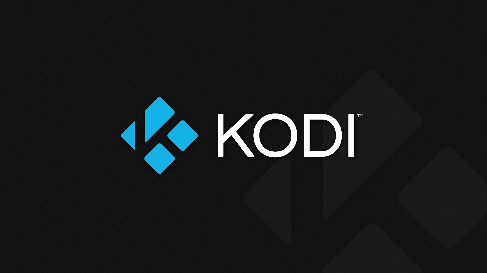

![Release][latest-release]
![Release Date][release-date]
![Language][language]
![License][license]
![Code Size][code-size]

<!-- PROJECT LOGO -->
<br />
<p align="center">
  <a href="https://github.com/demon-rem/kodi-strm/">
    
  </a>

  <h3 align="center">kodi-strm</h3>

  <p align="center">
    A small project to complement the Google Drive AddOn for Kodi
    <br><br>
    <a href="https://github.com/demon-rem/kodi-strm/"><strong>Explore the docs »</strong></a>
    <br />
    <br />
    ·
    <a href="https://github.com/demon-rem/kodi-strm/issues">Bug Report</a>
    ·
    <a href="https://github.com/demon-rem/kodi-strm/issues">Request Feature</a>
    ·
    <a href="https://github.com/demon-rem/kodi-strm/fork">Fork Repo</a>
    ·
  </p>
</p>
<br>

---
<br>
<!-- TABLE OF CONTENTS -->

## Table of Contents
- [About The Project](#about-the-project)
  - [What is a strm file?](#what-is-a-strm-file)
- [Pre-Requisites](#pre-requisites)
- [Setup](#setup)
    - [What do the setup scripts do?](#what-do-the-setup-scripts-do)
- [Usage](#usage)
  - [Generating strm files](#generating-strm-files)
  - [Where are the strm files placed?](#where-are-the-strm-files-placed)
- [Custom Arguments](#custom-arguments)
    - [Scanning Selective Folders](#scanning-selective-folders)
    - [Custom Destination Directory](#custom-destination-directory)
    - [Realtime Updates](#realtime-updates)
    - [Custom Name for Root Directory](#custom-name-for-root-directory)
- [Resources](#resources)
    - [Getting Folder ID's](#getting-folder-ids)
    - [Destination Directory vs Root Directory](#destination-directory-vs-root-directory)
- [Examples](#examples)
    - [Custom destination](#custom-destination)
    - [Scanning a folder selectively](#scanning-a-folder-selectively)
    - [Custom root directory](#custom-root-directory)
  - [Miscellaneous Examples](#miscellaneous-examples)
- [Is this script better than the existing add-on?](#is-this-script-better-than-the-existing-add-on)
  - [How does this script work](#how-does-this-script-work)
- [Advanced Setup](#advanced-setup)
- [Roadmap](#roadmap)
    - [A list of *possible* improvements;](#a-list-of-possible-improvements)
- [Contributions](#contributions)
- [License](#license)
- [Acknowledgements](#acknowledgements)
  - [Just some fun](#just-some-fun)


<!-- ABOUT THE PROJECT -->
## About The Project

A simple python script to complement the functionality of [Google Drive AddOn](https://kodi.tv/addon/music-add-ons-picture-add-ons-plugins-video-add-ons/google-drive) for Kodi.

For an add-on that [claims to be "*extremely fast*"](https://github.com/cguZZman/plugin.googledrive#google-drive-kodi-addon), I found the add-on to be quite slow (*and unreliable*). It crashes way too frequently, is slow, and gets stuck way too often (this happened frequently enough, to the point I decided to make this project just to solve this problem).

The main purpose of this project is to generate strm files for media file(s) present in a directory on Google Drive - and achieve this more reliably than the Kodi AddOn.

### What is a strm file?

In simple terms, *strm* files refer to files having an extension of `.strm`. They usually created and used by multimedia applications (Kodi and Plex being the main examples). They are used to store URL pointing to the actual media file(s) stored on in a remote server/cloud.

This URL is then used by the application to stream the actual media file when required.

<br>

---
## Pre-Requisites
* Python 3.5+

## Setup
1. Create a [Google Project](http://console.developers.google.com/) and [enable Google Drive API](https://developers.google.com/drive/api/v3/enable-drive-api).
2. Once you enable the Drive API for your project, setup credentials required to use this API.
3. Download the credentials as a JSON file and rename this file as `credentials.json`.
4. Move the `credentials.json` file into the same directory containing the python script.
5. Install the python dependencies.
    <br> `pip install -r requirements.txt`
6. Install [Kodi AddOn for Google Drive](https://kodi.tv/addon/music-add-ons-picture-add-ons-plugins-video-add-ons/google-drive) in your Kodi installation.
7. Login to the add-on. Make sure that you use the same Google account while logging into this script and the Google add-on.

Alternatively, for the fourth step, you can directly use the `setup.sh` or `setup.bat` scripts and have them create an efficient setup for you.

#### What do the setup scripts do?

The setup script will;
 * Update `pip`
 * Install `virtualenv`
 * Create a virtual environment named `.venv`
 * Activate this virtual package
 * Install required python packages into this virtual environment.

While anyone is free to use the direct setup files, do note that they are primarily for my use (to quickly setup a system for usage/testing/debugging) - and are *not guaranteed* to work in your system.

## Usage

Executing the python script directly (without custom arguments) will fetch a list of all teamdrives to which the account has access -- allowing you to select a teamdrive from this list which will then be scanned for media files.

Alternatively, you can pass [custom arguments](#custom-arguments) to the script to modify the default behaviour.

Once the script finishes generating strm files after a scan, add the resulting [directory as a source](https://kodi.wiki/view/Adding_video_sources) in your Kodi installation. From there on, Kodi will treat these `.strm` files as actual media files and will be able to scan/play them normally.

> Note: 
> 
> If you are unable to play the media files with Kodi, make sure that you have installed the [Kodi AddOn for Google Drive](https://kodi.tv/addon/music-add-ons-picture-add-ons-plugins-video-add-ons/google-drive) and have logged into the add-on with the **same** Google Account that you are using for this script.

Once you're comfortable with the usage of this script, you might want to take a look at the [advanced setup](#advanced-setup) section.

### Generating strm files

Running the python script without any custom arguments will fetch a list of all team-drives that are connected to the account, selecting a teamdrive from this list will make the script scan the contents of the particular teamdrive.

### Where are the strm files placed?

By default, the strm files generated after a scan are stored in the **working directory**. Use `pwd` in Unix-based systems, or `cd` in Windows get the location of current working directory. 

By deafult, the strm files are placed inside a directory with the **same name as the source** (the Google folder/teamdrive) scanned.

Note: Take a look at the flags for [custom destination directory](#custom-destination-directory) and [custom root directory](#custom-name-for-root-directory) to modify the directory inside which strm files are being generated.

## Custom Arguments

Using custom arguments, you can control the folder that is being scanned, modify the directory in which the strm files are being placed after a scan, modify the name of the root directory being used, choose if you want the script to run in silent mode or not and more.

Note: These flags can be passed only if the script is being executed from the terminal. 

#### Scanning Selective Folders

**Flag:** `--source=<folder-id>`  
**Value Expected:** ID of an existing folder on Google Drive.

By default, the script will prompt you to select a teamdrive as the source - the selected teamdrive will be completely scanned by the script. This might not always be desired. 

This flag allows you to scan the contents of any particular directory as needed, i.e. with the help of this flag instead of scanning a complete teamdrive (or the main drive), an individual folder can be selectively scanned using its ID.

> Note: Check [Getting the Folder ID](#getting-folder-ids) section to get the ID of a folder in Google Drive.

Side Note: Drive API treats teamdrives as folders, meaning that this flag can also be used to scan a teamdrive with it's ID.

[>> Using this Flag; Example](#scanning-a-folder-selectively)

#### Custom Destination Directory

**Flag:** `--dest="</path/to/destination>"`  
**Expected Value:** Path to an ***existing*** directory.

This flag is used to decide the destination directory in which the root directory (containing the strm files) will be placed.

[>> Resource: Destination Directory vs Root Directory](#destination-directory-vs-root-directory)

Make sure that path supplied as a value with this flag belongs to an **existing directory**. If the path contains spaces, wrap it inside double quotes.

[>> Using this Flag; Example](#custom-destination)

#### Realtime Updates

**Flag:** `--updates=<value>`  
**Expected Value:** `on` OR `off`

This is an optional flag to see real-time progress as the script is scanning items from the source. The value of `off` implies no updates are to be printed to the console - effectively running the script silently.

Having realtime updates might not always be desirable (especially if script is being run in the backgrond - me for one). Setting the value of this flag to `off` will run the script in silent mode - under silent mode, the only time this script will print to the console will be to notify that a scan has completed.

By default, the value of this flag is `on`, i.e. realtime progress will be displayed on the console.

[>> Using this Flag; Example](#miscellaneous-examples)

#### Custom Name for Root Directory

**Flag:** `--rootname=<root-directory>`  
**Expected Value:** Name for the root directory

Optional flag to modify the name of root directory that is created by this script during runtime.

[>> Resource: Destination Directory vs Root Directory](#destination-directory-vs-root-directory)

Be default, the name of the teamdrive/folder being scanned  will be used as the name of the root directory.

Important: If a directory with the same name as the root directory already exists inside destination directory, this script will ***erase the existing root directory***.

[>> Using this Flag; Example](#custom-root-directory)

## Resources

#### Getting Folder ID's

You can get the id for a particular folder by opening the folder and copying the id from the url.

For example, in the URL `https://drive.google.com/drive/folders/0AOC6NXsE2KJMUk9PTA`, the folder-id is `0AOC6NXsE2KJMUk9PTA`.

This method can also be used to get the ID of a particular TeamDrive and use it as a [custom argument](#scanning-selective-folders) to directly scan the teamdrive.


#### Destination Directory vs Root Directory

In basic terms, when the script scans a folder on drive, it creates a directory which will contain all the strm files being generated. 

This directory that has been created by the script, during the runtime is the ***Root Directory***. The parent directory that contains the root directory is termed as the ***Destination Directory***.

The path being used as the parent/destination directory should point to an already existing directory. On the other hand, if a directory with the same name as root directory is already present inside the destination, it will be wiped off.

As an example, take a look at this directory structure;

``` bash
│── E:
│   ├── Kodi Library
│   │   ├── Downloaded Media
│   │   │    ├── new-file.mp4.strm
│   │   │    ├── old-file-02.mp4.strm
│   │   ├── Collection
│   │   │    ├── movie-file.mkv.strm
│   ├── STRM Files
│   │   ├── Content Media
│   │   │    ├── movie-01.mkv.strm
│   │   │    ├── movie-02.mp4.strm
│   │   │    ├── trailer.mkv.strm
```

From above, strm files are present inside three directories, namely, `Downloaded Media`, `Collection` and `Content Media` - these are the *Root Directories*. The directories containing these root directories then become the `Destination Directory`. Meaning that, there are two destination directories, `Kodi Library` and `STRM Files`.


## Examples

#### Custom destination
Running the following command will generate the root directory (containing strm files) at the destination `/home/kodi library`. Make sure that this is a valid path and points to a directory.

`python strm-generator.py --dest="/home/kodi library"`

Note that since the path contains space, it has been wrapped in double spaces.

#### Scanning a folder selectively

Running the following command will scan a folder with the ID `0AOC6NXsE2KJMUk9PVA` on Google Drive. Make sure that the account you signed into the script with has access to this folder.

`python strm-generator.py --source=0AOC6NXsE2KJMUk9PVA --dest="/home/kodi library"`

Note the additional destination flag in the command, instead of placing the results in the working directory, the script will now place them inside `/home/kodi library`.

#### Custom root directory

Running the following command will generate strm files inside a directory named `new root directory`

`python strm-generator.py --source=0AOC6NXsE2KJMUk9PVA --dest="/home/kodi library" --rootname="new root directory"`

The strm files will be present in a directory named `new root directory` (this is the root directory). The root directory by itself will be present inside `"/home/kodi library"` (this being the destination directory).

### Miscellaneous Examples

* Scanning a particular folder on drive, with custom destination and root directories, plus no updates to the console (using all the flags at once).
> `python strm-generator.py --source=0AOC6NXsE2KJMUk9PVA --dest="/home/kodi libraries" --rootname="Staging; Media" --updates=off`

* Scanning a particular folder with no updates
> `python strm-generator.py --source=0AOC6NXsE2KJMUk9PVA --updates=off`

* Scanning a folder selectively with custom root directory
> `python strm-generator.py --source=0AOC6NXsE2KJMUk9PVA --rootname="Media"`

* Scanning a folder with custom destination directory and no updates on console
> `python strm-generator.py --source=0AOC6NXsE2KJMUk9PVA --dest="/home/Videos" --updates=off`


---

## Is this script better than the existing add-on?

Based on the tests I have run, this script didn't crash or lag, and was quite a bit faster than the add-on. Honestly, I'm not sure why this happens - while the Google Drive add-on is [open source](https://github.com/cguZZman/plugin.googledrive), I'm yet to take a proper look at it.

What I do know is, this script is as simple as it can be. There is no clever hack, or any trick present. Yet, all the tests I ran prove that this script is somehow better than the add-on (and no, this is **definitely not** because of any hardware limitation at my end).

It is possible that this difference is being caused by Kodi (or the integration between the add-on and Kodi). Regardless, I noticed a flaw, and wrote a simple script to overcome it effectively.

### How does this script work

The basic functioning of this script revolves around traversing a directory on Google Drive, iterating through each file present in this directory and generating an equivalent `.strm` file for every media file. An important part of this is to be able to recognize media files.

The most important step while creating a strm file is to ensure that the contents of the file are stored in such a manner that they can be parsed by the Google Drive add-on. This ensures that this script does not need to handle the part of using these strm files to stream the video. Once an strm file has been generated, everything else is being handled by the Kodi add-on, this includes parsing the strm file to get the actual URL and streaming media from the URL.

## Advanced Setup

This section contains ideas and suggestions to how you can use this script to get a seamless experience with you Kodi setup.

With a little help of [custom arguments](#custom-arguments) supported by the script, you can set up the script to be run on fixed intervals (with pre-fixed parameters).

For example, I'm on Linux, I've setup a [systemd.service](https://man7.org/linux/man-pages/man5/systemd.service.5.html) to run this script once every couple of days. At every run, the script scans a fixed folder from Google Drive, and places it inside an existing Kodi library.

Whenever I open up Kodi, it automatically scrapes the new files, and adds them to my library. And so, my system automatically fetches any updates on Google Drive, syncs them, and adds them to Kodi without requiring any input from me. 

If needed, the systemd service can be modified to run the script multiple times, scanning different sources each time to be able to scale my current setup to span across multiple teamdrives/folders, all this without requiring any sort of input.

Windows users can achieve the same functionality as systemd.service using [Windows Task Scheduler](https://en.wikipedia.org/wiki/Windows_Task_Scheduler). In case someone wants to replicate a similar setup as mine, here are some useful links to help you get started.

- [Creating a systemd.service](https://medium.com/@benmorel/creating-a-linux-service-with-systemd-611b5c8b91d6)
- [Using Windows Task Scheduler](https://windowsreport.com/schedule-tasks-windows-10)
- [Setting up Kodi for auto-scan](https://www.howtogeek.com/196025/ask-htg-how-do-you-set-your-xbmc-library-to-automatically-update/)


<!-- ROADMAP -->
## Roadmap

The main aim for this project isn't to replace the exising Google Drive AddOn, but to build upon it and fix the flaws. As such, a large part of what I found missing in the add-on has already been fixed -- namely, speed and reliablitly.

Based on the tests I've run, this script is ~20% faster than the Google Drive Add-On, and is a lot more reliable (no crashes so far).

> *For the curious, yes, I ran the test on the exact same source without any modifications. The results are as accurate as possible.*

#### A list of *possible* improvements;
- Improvement(s) on the GUI - ~~updating progress on the terminal while the script is running~~ added in [e451e08
](https://github.com/demon-rem/kodi-strm/commit/e451e087adcc3bc116f1718e0bc5a9100b81555a).
- Multithreading (still not sure on this one) - despite GIL, the execution speed can be improved to *some* extent.

## Contributions

Contributions are what make the open source community such an amazing place to learn, inspire, and create. Any contributions made are **extremely appreciated**.

1. Fork the Project
2. Create your Feature Branch (`git checkout -b feature/new-feature`)
3. Commit your Changes (`git commit -m 'Add amazing new features'`)
4. Push to the Branch (`git push origin feature/new-feature`)
5. Open a Pull Request

## License
Distributed under the MIT License. See [`LICENSE`](./LICENSE). for more information.

## Acknowledgements
* [Img Shields](https://shields.io): for the badges being used in this readme.
* [Google API Python Client](https://github.com/googleapis/google-api-python-client): a python wrapper to work with Drive API.
* [Coloroma](https://github.com/tartley/colorama): Used to print the names of teamdrives in separate colors while selecting a source in interactive mode.
* [Reprint](https://github.com/Yinzo/reprint): Used to provide updates on the console.
* Special credits to [Satan](https://github.com/not-satan) for being annoying enough to force me to work on this repo as a priority.

<br>

---
### Just some fun


[code-size]: https://img.shields.io/github/languages/code-size/demon-rem/kodi-strm?style=for-the-badge
[language]: https://img.shields.io/github/languages/top/demon-rem/kodi-strm?style=for-the-badge
[license]: https://img.shields.io/github/license/demon-rem/kodi-strm?style=for-the-badge
[latest-release]: https://img.shields.io/github/v/release/demon-rem/kodi-strm?style=for-the-badge
[release-date]: https://img.shields.io/github/release-date/demon-rem/kodi-strm?style=for-the-badge
[issues-url]: https://img.shields.io/github/issues-raw/demon-rem/kodi-strm?style=for-the-badge
